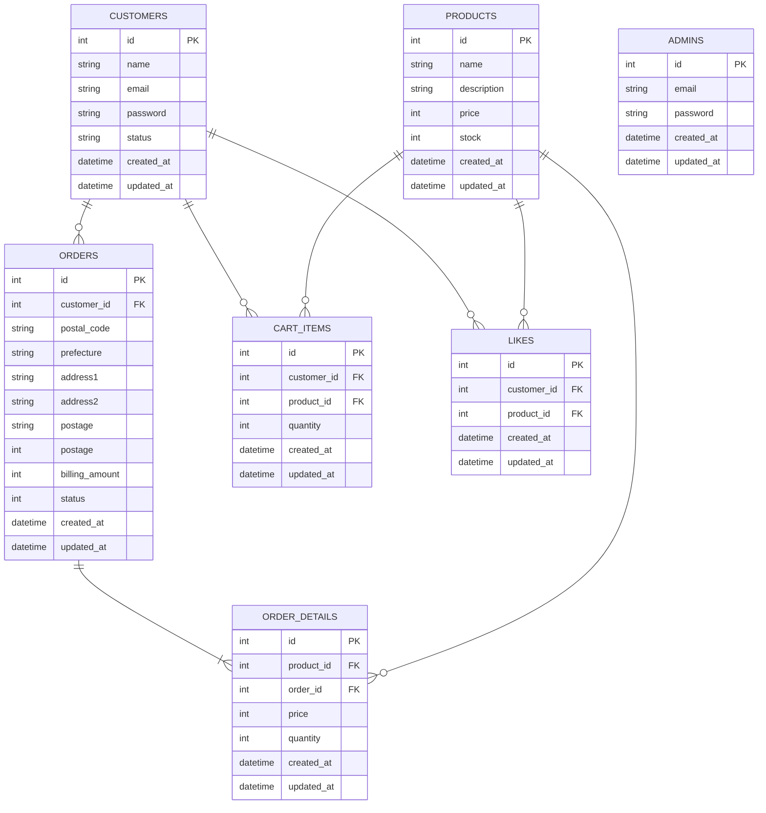

```mermaid
erDiagram
    CUSTOMERS ||--o{ ORDERS : ""
    CUSTOMERS ||--o{ CART_ITEMS : ""
    CUSTOMERS ||--o{ LIKES : ""
    ORDERS ||--|{ ORDER_DETAILS : ""
    PRODUCTS ||--o{ ORDER_DETAILS : ""
    PRODUCTS ||--o{ CART_ITEMS : ""
    PRODUCTS ||--o{ LIKES: ""

    CUSTOMERS {
        int id PK
        string name
        string email
        string password 
        string status
        datetime created_at
        datetime updated_at
    }

    ADMINS {
        int id PK
        string email
        string password
        datetime created_at
        datetime updated_at
    }


    CART_ITEMS {
        int id PK
        int customer_id FK
        int product_id FK
        int quantity
        datetime created_at
        datetime updated_at
    }

    ORDERS {
        int id PK
        int customer_id FK
        string postal_code
        string prefecture
        string address1
        string address2
        string postage
        int postage
        int billing_amount
        int status
        datetime created_at
        datetime updated_at
    }


    PRODUCTS{
        int id PK
        string name
        string description
        int price
        int stock
        datetime created_at
        datetime updated_at
    }

    ORDER_DETAILS{
        int id PK
        int product_id FK
        int order_id FK
        int price
        int quantity
        datetime created_at
        datetime updated_at
    }

    LIKES{
        int id PK
        int customer_id FK
        int product_id FK
        datetime created_at
        datetime updated_at
    }
```